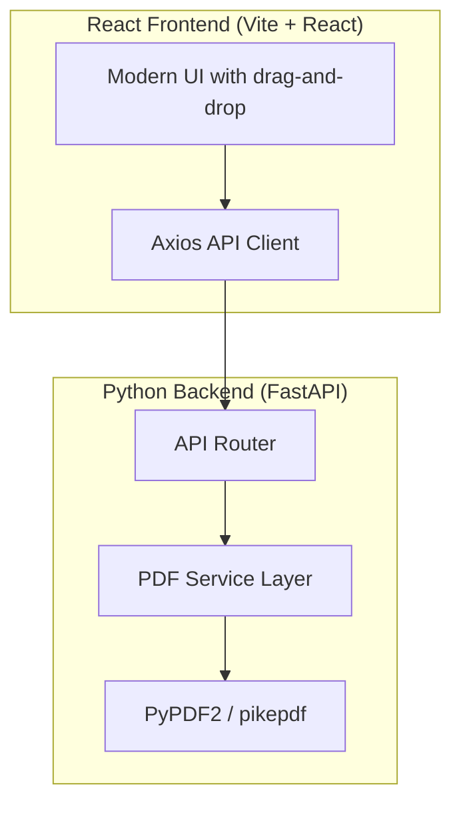

# Stupid PDF — Full-Stack PDF Processing App

A modern PDF processing application with a **React** frontend and **Python (FastAPI)** backend, supporting 11 PDF operations.

## Proposed Architecture



### Tech Stack

| Layer | Technology | Rationale |
|-------|-----------|-----------|
| **Frontend** | React 18 + Vite | Fast dev server, modern tooling |
| **Styling** | Vanilla CSS | Full control, premium design |
| **Backend** | FastAPI (Python) | Async support, auto-docs, type safety |
| **PDF Engine** | PyPDF2 + pikepdf | PyPDF2 for most ops, pikepdf for compression |
| **File Upload** | python-multipart | Required by FastAPI for file uploads |
| **CORS** | fastapi[cors] | Allow React dev server to call API |

---

## Proposed Changes

### Backend — Python FastAPI

#### [NEW] [requirements.txt](file:///Users/amanullakhan/Developer/stupid-pdf/backend/requirements.txt)
- `fastapi`, `uvicorn[standard]`, `python-multipart`, `PyPDF2`, `pikepdf`

#### [NEW] [main.py](file:///Users/amanullakhan/Developer/stupid-pdf/backend/main.py)
- FastAPI app with CORS middleware
- Mount all PDF route handlers

#### [NEW] [routes/pdf_routes.py](file:///Users/amanullakhan/Developer/stupid-pdf/backend/routes/pdf_routes.py)
- API endpoints for all 11 PDF operations
- Each returns a `StreamingResponse` with the processed PDF

#### [NEW] [services/pdf_service.py](file:///Users/amanullakhan/Developer/stupid-pdf/backend/services/pdf_service.py)
- Core PDF processing logic using PyPDF2/pikepdf
- Functions: `merge`, `split`, `compress`, `extract_pages`, `delete_pages`, `rearrange_pages`, `rotate_pages`, `duplicate_pages`, `reverse_order`, `insert_blank_pages`, `add_pdf_to_existing`

---

### Frontend — React + Vite

#### [NEW] Frontend scaffolded via `create-vite`
- React 18 project initialized with Vite

#### [NEW] [src/App.jsx](file:///Users/amanullakhan/Developer/stupid-pdf/frontend/src/App.jsx)
- Main app with sidebar navigation for all 11 tools
- Route-based tool selection

#### [NEW] [src/index.css](file:///Users/amanullakhan/Developer/stupid-pdf/frontend/src/index.css)
- Premium dark-mode design system
- Glassmorphism cards, smooth gradients, micro-animations
- Google Font: Inter

#### [NEW] [src/components/FileUpload.jsx](file:///Users/amanullakhan/Developer/stupid-pdf/frontend/src/components/FileUpload.jsx)
- Drag-and-drop file upload zone with visual feedback
- Supports single and multi-file upload modes

#### [NEW] [src/components/Sidebar.jsx](file:///Users/amanullakhan/Developer/stupid-pdf/frontend/src/components/Sidebar.jsx)
- Navigation sidebar listing all 11 PDF tools
- Active state highlighting, icons, smooth transitions

#### [NEW] [src/components/ToolPage.jsx](file:///Users/amanullakhan/Developer/stupid-pdf/frontend/src/components/ToolPage.jsx)
- Generic tool page component that renders the appropriate UI for each operation
- Handles file upload, configuration inputs (page numbers, rotation angle, etc.), and download

#### [NEW] [src/api/pdf.js](file:///Users/amanullakhan/Developer/stupid-pdf/frontend/src/api/pdf.js)
- Axios-based API client for all 11 endpoints
- Handles multipart/form-data uploads and blob downloads

---

## API Endpoints

| Method | Endpoint | Body | Description |
|--------|----------|------|-------------|
| POST | `/api/merge` | Multiple PDF files | Merge PDFs into one |
| POST | `/api/split` | PDF + split config | Split PDF into parts |
| POST | `/api/compress` | PDF file | Compress PDF |
| POST | `/api/extract-pages` | PDF + page numbers | Extract specific pages |
| POST | `/api/delete-pages` | PDF + page numbers | Delete specific pages |
| POST | `/api/rearrange-pages` | PDF + new order | Rearrange pages |
| POST | `/api/rotate-pages` | PDF + pages + angle | Rotate specific pages |
| POST | `/api/duplicate-pages` | PDF + pages to duplicate | Duplicate specific pages |
| POST | `/api/reverse` | PDF file | Reverse page order |
| POST | `/api/insert-blank` | PDF + positions | Insert blank pages |
| POST | `/api/add-pdf` | Base PDF + new PDF + position | Insert PDF into another |

---

## UI Design Direction

- **Dark theme** with deep navy/charcoal background (`#0a0e1a` → `#1a1f35`)
- **Accent gradient**: Electric blue → Purple (`#6366f1` → `#a855f7`)
- **Glassmorphism** cards with `backdrop-filter: blur()`
- **Smooth micro-animations** on hover, file drop, and processing states
- **Drag-and-drop** file zones with pulsing border animation
- **Inter** font from Google Fonts
- **Responsive** — works on desktop and tablet

---

## Project Structure

```
stupid-pdf/
├── backend/
│   ├── main.py
│   ├── requirements.txt
│   ├── routes/
│   │   └── pdf_routes.py
│   └── services/
│       └── pdf_service.py
├── frontend/
│   ├── index.html
│   ├── package.json
│   ├── vite.config.js
│   ├── public/
│   └── src/
│       ├── App.jsx
│       ├── App.css
│       ├── index.css
│       ├── main.jsx
│       ├── api/
│       │   └── pdf.js
│       └── components/
│           ├── FileUpload.jsx
│           ├── Sidebar.jsx
│           └── ToolPage.jsx
└── README.md
```

---

## Verification Plan

### Automated Tests
- Start the backend: `cd backend && uvicorn main:app --reload`
- Start the frontend: `cd frontend && npm run dev`
- Test each API endpoint with sample PDFs

### Manual Verification
- Upload PDFs through the UI and verify all 11 operations produce correct output
- Test drag-and-drop functionality
- Verify responsive layout on different screen sizes
